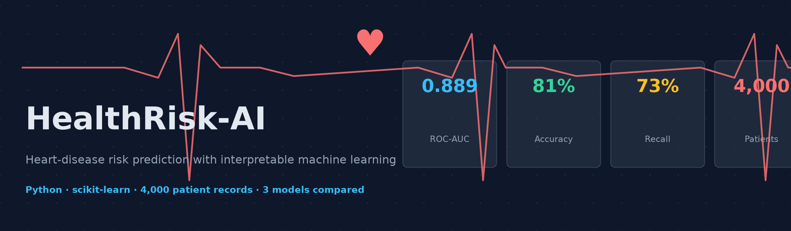
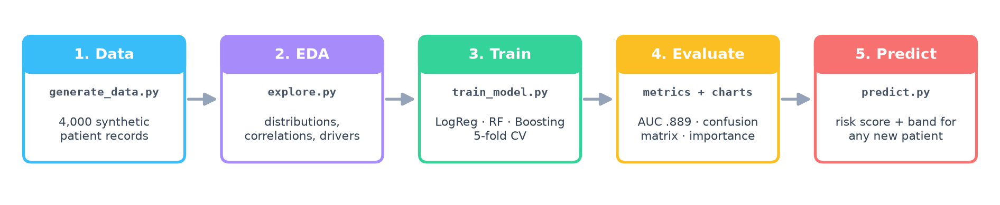
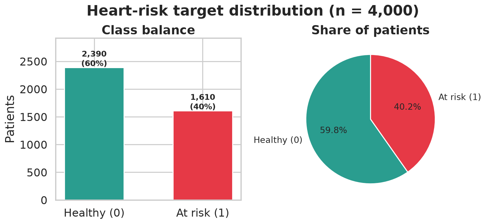
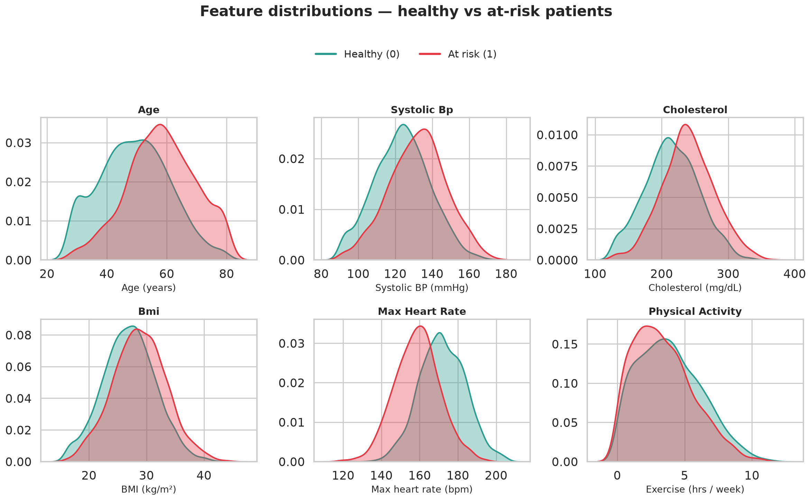
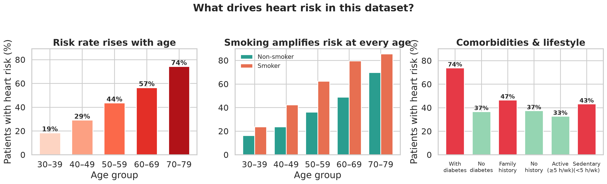
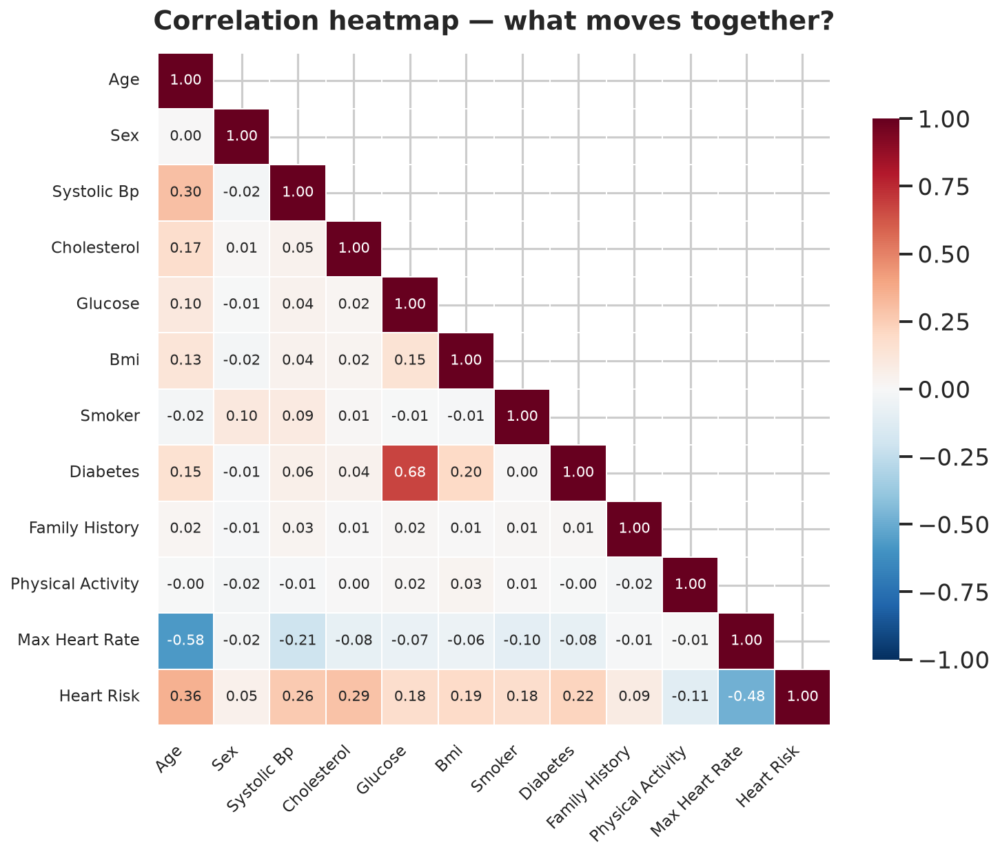
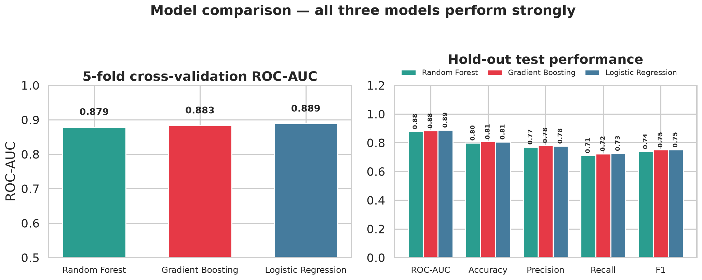
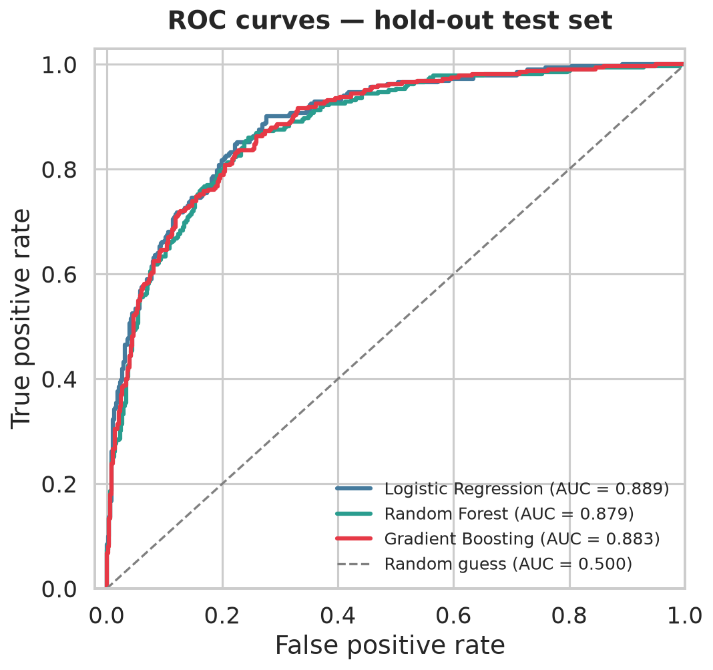
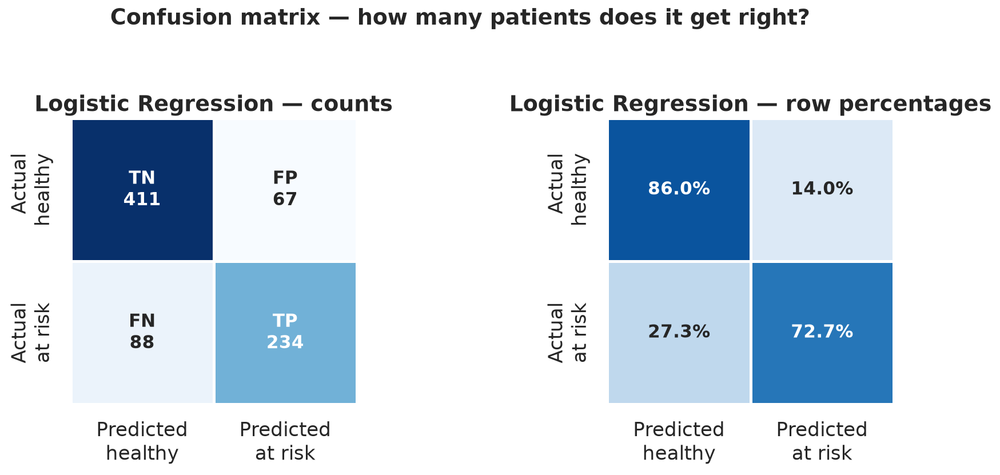
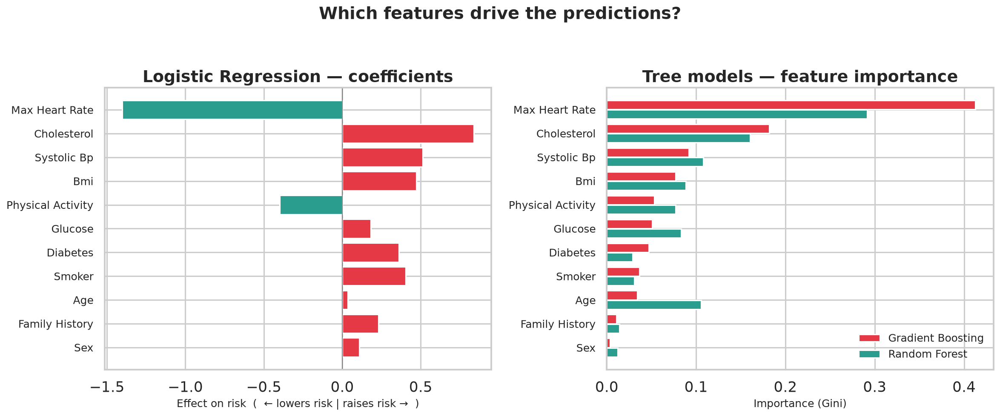

# 🫀 HealthRisk-AI

<p align="center">
  
</p>

<p align="center">
  <b>Heart-disease risk prediction with interpretable machine learning.</b><br>
  An end-to-end data-science project: data → EDA → 3 models → evaluation → predictions.
</p>

<p align="center">
  
  
  
  
  
</p>

---

## 📌 What is this?

**HealthRisk-AI** predicts how likely a patient is to have heart disease from
11 routine clinical measures (age, blood pressure, cholesterol, BMI, smoking
status, …). It is built as a **fully reproducible pipeline** — every chart and
number below can be regenerated with three commands.

> **The headline result:** a Logistic Regression model reaches
> **ROC-AUC 0.889** and **81% accuracy**, catching **73% of at-risk patients**,
> while staying fully interpretable — you can read exactly *why* it flags a
> patient (see [feature importance](#-which-features-drive-the-prediction)).

<p align="center">
  
</p>

---

## 🚀 Quickstart

```bash
git clone https://github.com/Sal1243/Data-scientist-HealthRisk-AI.git
cd Data-scientist-HealthRisk-AI

pip install -r requirements.txt

python src/generate_data.py   # 1. create the dataset   → data/
python src/explore.py         # 2. exploratory charts   → images/
python src/train_model.py     # 3. train + evaluate     → models/, results/, images/
python src/predict.py         # 4. score new patients   → console report
```

Every script is deterministic (seed = 42): you will get **exactly** the
charts and metrics shown here.

---

## 📊 The data

4,000 patient records with **11 features** and 1 binary target
(`heart_risk`: 0 = healthy, 1 = at risk). The dataset is synthetically
generated with clinically-informed risk relationships — real-world
patient data cannot be shared on GitHub, so the generator reproduces
realistic Framingham-style patterns instead. Swap in your own CSV with the
same columns to use real data.

| Feature | Description | Range in data |
|---|---|---|
| `age` | Age in years | 29 – 79 |
| `sex` | 1 = male, 0 = female | 0 / 1 |
| `systolic_bp` | Systolic blood pressure (mmHg) | 92 – 200 |
| `cholesterol` | Total cholesterol (mg/dL) | 130 – 400 |
| `glucose` | Fasting glucose (mg/dL) | 68 – 300 |
| `bmi` | Body mass index (kg/m²) | 16.5 – 48 |
| `smoker` | Current smoker | 0 / 1 |
| `diabetes` | Diagnosed diabetes | 0 / 1 |
| `family_history` | Family history of heart disease | 0 / 1 |
| `physical_activity` | Exercise (hours / week) | 0 – 14 |
| `max_heart_rate` | Max achieved heart rate (bpm) | 72 – 205 |

<p align="center">
  
</p>

The classes are reasonably balanced (60 / 40), so accuracy is a meaningful
metric alongside ROC-AUC and recall.

---

## 🔍 What the data says (EDA)

At-risk patients are **older**, with **higher blood pressure, cholesterol and
glucose**, **higher BMI**, and **lower peak heart rate** (a marker of fitness):

<p align="center">
  
</p>

Risk climbs steeply with age — from **19% in the 30s to 74% in the 70s** —
and **smoking adds risk at every age band**, with the gap widening in older
groups (the age × smoking interaction). Diabetes nearly **doubles** the risk
(74% vs 37%):

<p align="center">
  
</p>

Correlations confirm the story: `heart_risk` correlates positively with
cholesterol (0.29), systolic BP (0.26), age (0.36) and negatively with
max heart rate (−0.48):

<p align="center">
  
</p>

---

## 🤖 Models & results

Three classifiers are trained on an 80/20 stratified split with 5-fold
cross-validation — a simple **interpretable** model and two **ensemble** models:

| Model | CV ROC-AUC | Test ROC-AUC | Accuracy | Precision | Recall | F1 |
|---|---|---|---|---|---|---|
| **Logistic Regression** ⭐ | **0.878 ± 0.010** | **0.889** | **0.806** | 0.777 | **0.727** | 0.751 |
| Gradient Boosting | 0.870 ± 0.013 | 0.883 | 0.808 | **0.782** | 0.724 | **0.752** |
| Random Forest | 0.865 ± 0.012 | 0.879 | 0.799 | 0.771 | 0.711 | 0.740 |

> ⭐ The **simplest model wins.** On tabular data with mostly linear,
> additive risk effects, Logistic Regression matches the ensembles — while
> its coefficients remain directly explainable to clinicians.

<p align="center">
  
</p>

<p align="center">
  
</p>

On the 800 held-out patients, the best model correctly clears **86% of
healthy patients** and flags **73% of at-risk patients**:

<p align="center">
  
</p>

---

## 🧭 Which features drive the prediction?

The model's view of risk matches medical intuition: **low exercise capacity**
(max heart rate) and **high cholesterol / blood pressure / BMI** push risk up;
**activity** pushes it down:

<p align="center">
  
</p>

---

## 🩺 Scoring a new patient

```bash
python src/predict.py
```

```text
Loaded model : Logistic Regression
--------------------------------------------------------------
Patient A — healthy profile    risk =  0.9%  [LOW     ] OK
Patient B — average profile    risk = 51.9%  [MODERATE] WATCH
Patient C — high-risk profile  risk = 100.0% [HIGH    ] ALERT
--------------------------------------------------------------
```

Risk bands: **LOW** < 30% ≤ **MODERATE** < 60% ≤ **HIGH**.
Edit `EXAMPLE_PATIENTS` in `src/predict.py` or load the pipeline yourself:

```python
import joblib, pandas as pd

bundle = joblib.load("models/heart_risk_model.joblib")
model, features = bundle["model"], bundle["features"]

patient = pd.DataFrame([[66, 1, 158, 288, 148, 33.4, 1, 1, 1, 0.5, 132]],
                       columns=features)          # values in the order above
print(f"{model.predict_proba(patient)[0, 1]:.1%}")  # → 100.0%
```

---

## 📁 Project structure

```text
Data-scientist-HealthRisk-AI/
├── README.md                  ← you are here
├── requirements.txt
├── data/
│   └── heart_risk_data.csv    # 4,000 records (generated)
├── src/
│   ├── generate_data.py       # 1. reproducible dataset
│   ├── explore.py             # 2. EDA → images/01–04
│   ├── train_model.py         # 3. train/compare 3 models → images/05–08
│   ├── predict.py             # 4. score new patients
│   └── make_banner.py         # 5. README artwork
├── models/
│   └── heart_risk_model.joblib
├── results/
│   ├── metrics.json           # headline numbers
│   └── model_comparison.csv   # full metric table
└── images/                    # all charts embedded above
```

---

## 🗺️ Roadmap

- [ ] Swap-in loader for real datasets (e.g. UCI Heart Disease / Framingham)
- [ ] SHAP-based per-patient explanations
- [ ] Streamlit web app for interactive risk checks
- [ ] Calibration curves & decision-threshold tuning for clinical recall targets

## ⚠️ Disclaimer

This project is built on **synthetic data** for educational and portfolio
purposes. It is **not a medical device** and must not be used for real
clinical decisions.

## 📄 License

[MIT](LICENSE) — free to use, learn from, and build upon.
